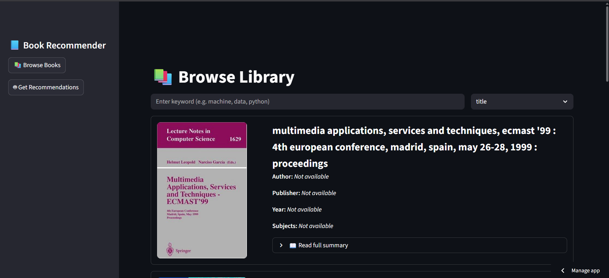
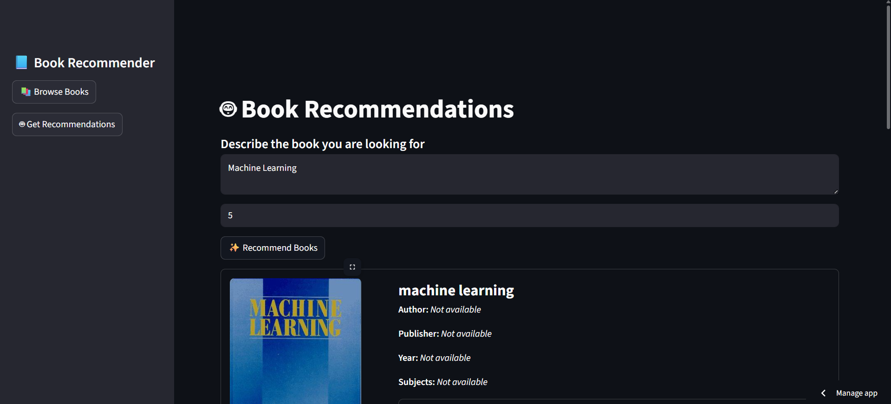

# 📚 Book Recommendation System  
### End-to-End ETL Pipeline + Google Books Enrichment + FastAPI Service  
A Complete Data Engineering Project

---

## Live Application

Streamlit Deployment:  
https://book-recommendation-system-dhruv-mahak.streamlit.app/

---

## Tech Stack

### Backend & API
- Python
- FastAPI
- Uvicorn
- SQLAlchemy
- SQLite

### Data Engineering
- Pandas
- Multithreading
- Google Books API
- Deterministic ETL architecture
- Hash-based stable identifiers

### Recommendation Layer
- Content-based filtering
- Transformer-based feature engineering

### Frontend
- Streamlit
- Streamlit Cloud deployment

---

## Recommendation System UI

### Homepage / Search Interface


### Recommendation Results View


---

## 1. Introduction & Motivation

Modern recommendation systems rely on clean, structured, and enriched data.  
Raw library or OPAC datasets are often:

- Inconsistent in schema  
- Noisy and duplicated  
- Missing semantic metadata (authors, categories, descriptions)

This project addresses those challenges by building a production-style data pipeline
that transforms raw CSV book records into a queryable, enriched database, and exposes
the data through a REST API for downstream applications such as:

- Book recommendation systems
- Semantic search
- Analytics dashboards
- LLM-based applications

The project follows real-world data engineering principles:

- Clear separation of pipeline stages
- Deterministic and resume-safe processing
- CLI-driven configuration
- Database-backed persistence
- API-based data access

---

## 2. High-Level Capabilities

This system provides:

- Robust ingestion of raw CSV files  
- Data cleaning, normalization, and deduplication  
- External enrichment via Google Books API  
- Persistent storage using SQLite  
- FastAPI service for browsing and searching books  
- Fully self-documenting CLI (`--help` on every stage)  

---

## 3. Project Structure & Responsibilities

Each folder has one clear responsibility, mirroring how production pipelines are organized.

```
book-recommendation-system/
│
├── api/
│   └── main.py
├── data/
│   ├── raw_data/
│   ├── ingested_data/
│   ├── clean_data/
│   ├── enriched_data/
│   ├── storage_data/
│   └── assets/
│       ├── recommendation_1.png
│       └── recommendation_2.png
├── frontend/
    ├── app.py
├── notebook/
│   └── data.ipynb
├── pipeline/
│   ├── clean.py
│   ├── ingestion.py
│   ├── transformation.py
│   ├── pipeline_runner.py
│   └── json_to_features.py
├── recommender/
    ├── advanced_transformer_recommender.py
    ├── build_faiss_index.py
    ├── transformer_embedding_builder.py
├── .dockerignore
├── Dockerfile
├── storage/
│   └── db.py
└── README.md
```

This structure ensures:

- Clear data lineage
- Easy debugging
- Independent execution of each stage

---

## 4. Pipeline Architecture (End-to-End Flow)

The pipeline is linear, deterministic, and restartable.

```
┌──────────────────────┐
│   Raw CSV Files      │
│  (Untrusted Input)   │
└──────────┬───────────┘
           │
           ▼
┌────────────────────────────┐
│ INGESTION                  │
│ - Standardize schema       │
│ - Ensure required columns  │
│ - Minimal type fixes       │
└──────────┬─────────────────┘
           │
           ▼
┌────────────────────────────┐
│ CLEANING                   │
│ - Normalize text           │
│ - Validate ISBNs           │
│ - Deduplicate records      │
│ - Generate stable IDs      │
└──────────┬─────────────────┘
           │
           ▼
┌────────────────────────────┐
│ TRANSFORMATION             │
│ - Google Books API         │
│ - Multithreaded enrichment │
│ - Resume-safe execution    │
└──────────┬─────────────────┘
           │
           ▼
┌────────────────────────────┐
│ STORAGE                    │
│ - JSON → SQLite            │
│ - Duplicate-safe inserts   │
└──────────┬─────────────────┘
           │
           ▼
┌────────────────────────────┐
│ FASTAPI SERVICE            │
│ - Browse books             │
│ - Search & lookup          │
│ - Trigger pipeline         │
└────────────────────────────┘
```

---

## 5. Running the Complete Pipeline

To execute all ETL stages in order, run:

```
python pipeline/main.py
```

### Final Artifact

```
data/storage_data/books.sqlite
```

This database becomes the single source of truth for the API.

---

## 6. Detailed Stage Explanations

### 6.1 Ingestion Stage

Goal:  
Convert raw, inconsistent CSV files into a canonical schema.

Key Design Choices:
- No cleaning or deduplication (by design)
- Schema-first approach
- Fail-safe handling of missing columns

Why this matters:  
Keeps ingestion lightweight and repeatable, deferring complex logic to later stages.

Default Run:

```
python pipeline/ingestion.py
```

Custom Input / Output:

```
python pipeline/ingestion.py \
  --input-dir my_raw_csvs \
  --output-dir my_ingested_csvs
```

---

### 6.2 Cleaning Stage

Goal:  
Improve data quality and remove redundancy.

Operations:
- Normalize text (lowercase, trim, whitespace fix)
- Validate ISBNs (10/13-digit)
- Drop records without titles
- Deduplicate:
  - ISBN-based (preferred)
  - Title + Author fallback
- Generate stable `record_id` using hashing

Why this matters:  
Downstream enrichment and storage rely on high-quality, unique records.

Default Run:

```
python pipeline/clean.py
```

Custom Input / Output:

```
python pipeline/clean.py \
  --input-dir data/ingested_data \
  --output-file output/clean_books.csv
```

---

### 6.3 Transformation (Enrichment) Stage

Goal:  
Add semantic metadata using Google Books API.

Enrichment Strategy:
1. Search by ISBN (highest precision)
2. Fallback to title + author search

Reliability Features:
- Multithreading with controlled concurrency
- Hard API timeouts
- Incremental atomic saves
- Resume-safe after interruption

Default Run:

```
python pipeline/transformation.py
```

Custom Input / Output:

```
python pipeline/transformation.py \
  --input-csv clean.csv \
  --output-json enriched.json
```

---

### 6.4 Storage Stage

Goal:  
Persist enriched records in a query-efficient format.

Design Choices:
- SQLite (portable, zero-config)
- Fixed schema
- INSERT OR IGNORE to prevent duplicates
- JSON serialization for list fields

Default Run:

```
python storage/db.py
```

Custom Input / Output:

```
python storage/db.py \
  --input-json enriched.json \
  --output-db books.sqlite
```

---

## 7. FastAPI Service

Start API Server:

```
uvicorn api.main:app --reload
```

Available Endpoints:

- GET /books/
- GET /books/isbn/{isbn}
- GET /search/?q=term
- POST /sync/

Swagger UI:  
http://localhost:8000/docs

---

## 8. Pipeline Statistics & Data Quality Report

### 8.1 Raw Data Statistics (Before ETL)

| Metric | Value |
|------|------:|
| Total raw rows | 36,364 |
| Unique titles | 30,906 |
| Missing titles | 0 |
| Missing ISBNs | 412 |

Observation:
- Raw data already contains duplicates
- ISBN coverage is high, but not complete
- No missing titles

---

### 8.2 Ingestion Stage Statistics

| Metric | Value |
|------|------:|
| Total ingested rows | 36,364 |
| Unique titles | 30,906 |
| Unique ISBNs | 31,546 |
| Missing ISBNs | 412 |
| Missing year values | 170 |

Observation:
- Ingestion preserves row count exactly
- No records are dropped

---

### 8.3 Cleaning Stage Statistics

| Metric | Value |
|------|------:|
| Total cleaned rows | 31,946 |
| Unique record_id | 31,946 |
| Unique ISBNs | 26,871 |
| Missing ISBNs | 5,075 |
| Duplicate records removed | 4,418 |

#### Deduplication Breakdown

| Category | Count |
|-------|------:|
| ISBN-based books | 26,871 |
| Non-ISBN books | 5,075 |

Observation:
- Cleaning removes ~12% duplicate/noisy records
- Non-ISBN books preserved using fallback logic

---

### 8.4 Enrichment Statistics

| Metric | Value |
|------|------:|
| Total processed books | 31,946 |
| Successfully enriched | 9,221 |
| Missing enrichment | 22,725 |
| Enrichment success rate | 28.86% |

### 8.5 Summary Length Statistics

| Metric | Value |
|--------|------:|
| Total books | 7,313 |
| Minimum length | 1 word |
| Maximum length | 2,585 words |
| Average length | 128.30 words |

### 8.6 Metadata Coverage (FOUND records):

| Field | Available |
|-----|---------:|
| Authors | 8,348 |
| Subjects | 8,497 |
| Summary | 7,313 |
| Publisher | 6,708 |

---

### 8.7 Final Dataset Statistics

| Metric | Value |
|------|------:|
| Final books stored | 31,895 |
| Unique titles | 30,246 |
| Unique ISBNs | 26,026 |

---

### 8.8 Pipeline Row Count Summary

| Stage | Rows |
|------|-----:|
| Raw | 36,364 |
| Ingested | 36,364 |
| Cleaned | 31,946 |
| Enriched | 31,946 |

---

## 9. Data Dictionary

| Field | Description |
|------|------------|
| record_id | Stable hashed identifier |
| book_key | Unique composite key |
| status | FOUND / MISSING |
| title | Normalized title |
| authors | JSON list |
| isbn | Valid ISBN |
| year | Publication year |
| subjects | Category list |
| summary | Description |
| publisher | Publisher name |

---

## 10. Design Philosophy

This project emphasizes:

- Separation of concerns
- Reproducibility
- Operational safety
- Explainability
- Real-world engineering patterns

---

## 11. Conclusion

This project demonstrates a complete production-style data pipeline:

- Quantifiable data-quality improvements
- Deterministic ETL stages
- Resume-safe enrichment
- Persistent storage
- API-based data access

It forms a strong foundation for semantic search and recommendation systems.
